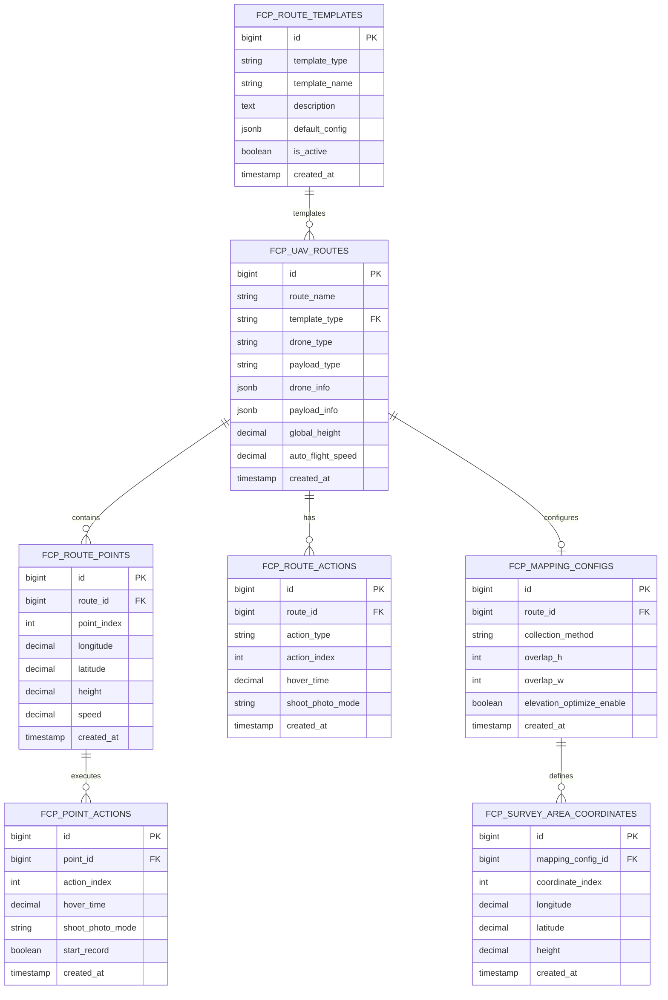

# 无人机航线管理系统数据库设计文档（精简版）

## 1. 设计概述

本文档描述了无人机航线管理系统的PostgreSQL数据库设计，专注于航线管理、航点管理、动作管理和KMZ文件处理的核心业务功能。精简后的设计包含7张核心业务表，所有表名统一使用`fcp_`前缀以区分独立业务模块，通过Java枚举管理设备类型，降低系统复杂度。

### 设计特点

* **业务聚焦**：专注航线管理核心功能

* **结构精简**：7张表覆盖所有核心业务

* **命名规范**：统一使用`fcp_`前缀，采用下划线分隔命名

* **类型管理**：设备类型通过代码枚举管理

* **扩展灵活**：JSONB字段支持动态配置

* **性能优化**：合理的索引策略

* **主键策略**：使用雪花算法生成分布式唯一ID，Java类型为Long，数据库类型为BIGINT，支持高并发场景

## 2. 数据库表结构

### 2.1 航线表 (fcp\_uav\_routes)

**表作用**：存储无人机航线的基本信息和全局配置参数

```sql
CREATE TABLE fcp_uav_routes (
    id BIGINT PRIMARY KEY COMMENT '主键ID（雪花算法生成）',
    route_name VARCHAR(255) NOT NULL COMMENT '航线名称',
    template_type VARCHAR(50) NOT NULL COMMENT '航线模板类型：waypoint/mapping2d/mapping3d/mappingStrip',
    drone_type VARCHAR(50) NOT NULL COMMENT '无人机类型（枚举值）',
    payload_type VARCHAR(50) NOT NULL COMMENT '负载类型（枚举值）',
    drone_info JSONB COMMENT '无人机详细信息（可选）',
    payload_info JSONB COMMENT '负载详细信息（可选）',
    payload_position INTEGER COMMENT '负载挂载位置',
    image_format VARCHAR(20) COMMENT '图片存储格式',
    finish_action VARCHAR(50) COMMENT '航线结束动作',
    exit_on_rc_lost_action VARCHAR(50) COMMENT '失控动作',
    global_height DECIMAL(10,3) COMMENT '全局航线高度（米）',
    auto_flight_speed DECIMAL(8,3) COMMENT '全局飞行速度（米/秒）',
    gimbal_pitch_mode VARCHAR(50) COMMENT '云台俯仰角控制模式',
    take_off_ref_point VARCHAR(255) COMMENT '参考起飞点坐标',
    waypoint_heading_mode VARCHAR(50) COMMENT '全局偏航角模式',
    waypoint_heading_angle DECIMAL(8,3) COMMENT '全局偏航角度',
    waypoint_poi_point VARCHAR(255) COMMENT '全局兴趣点坐标',
    waypoint_turn_mode VARCHAR(50) COMMENT '全局航点转弯模式',
    waypoint_turn_damping_dist DECIMAL(8,3) COMMENT '全局转弯阻尼距离',
    use_straight_line INTEGER COMMENT '是否使用直线飞行',
    description TEXT COMMENT '航线描述',
    created_at TIMESTAMP WITH TIME ZONE DEFAULT NOW(),
    updated_at TIMESTAMP WITH TIME ZONE DEFAULT NOW()
);

-- 索引
CREATE INDEX idx_fcp_uav_routes_template_type ON fcp_uav_routes(template_type);
CREATE INDEX idx_fcp_uav_routes_drone_type ON fcp_uav_routes(drone_type);
CREATE INDEX idx_fcp_uav_routes_created_at ON fcp_uav_routes(created_at DESC);
```

### 2.2 航点表 (fcp\_route\_points)

**表作用**：存储航线中每个航点的位置和飞行参数

```sql
CREATE TABLE fcp_route_points (
    id BIGINT PRIMARY KEY COMMENT '主键ID（雪花算法生成）',
    route_id BIGINT NOT NULL REFERENCES fcp_uav_routes(id) ON DELETE CASCADE,
    point_index INTEGER NOT NULL COMMENT '航点序号',
    longitude DECIMAL(12,9) NOT NULL COMMENT '经度',
    latitude DECIMAL(12,9) NOT NULL COMMENT '纬度',
    height DECIMAL(10,3) COMMENT '航点高度（米）',
    speed DECIMAL(8,3) COMMENT '航点飞行速度（米/秒）',
    yaw_angle DECIMAL(8,3) COMMENT '偏航角（度）',
    turn_mode VARCHAR(50) COMMENT '转弯模式',
    gimbal_pitch_angle DECIMAL(8,3) COMMENT '云台俯仰角（度）',
    waypoint_heading_mode VARCHAR(50) COMMENT '航点偏航角模式',
    waypoint_heading_angle DECIMAL(8,3) COMMENT '航点偏航角度',
    waypoint_poi_point VARCHAR(255) COMMENT '航点兴趣点坐标',
    waypoint_turn_mode VARCHAR(50) COMMENT '航点转弯模式',
    waypoint_turn_damping_dist DECIMAL(8,3) COMMENT '航点转弯阻尼距离',
    use_straight_line INTEGER COMMENT '是否使用直线飞行',
    is_start_and_end_point BOOLEAN DEFAULT FALSE COMMENT '是否为起始或结束点',
    created_at TIMESTAMP WITH TIME ZONE DEFAULT NOW()
);

-- 索引
CREATE INDEX idx_fcp_route_points_route_id ON fcp_route_points(route_id);
CREATE INDEX idx_fcp_route_points_route_index ON fcp_route_points(route_id, point_index);
CREATE UNIQUE INDEX idx_fcp_route_points_unique ON fcp_route_points(route_id, point_index);
```

### 2.3 航点动作表 (fcp\_point\_actions)

**表作用**：存储每个航点的具体动作指令

```sql
CREATE TABLE fcp_point_actions (
    id BIGINT PRIMARY KEY COMMENT '主键ID（雪花算法生成）',
    point_id BIGINT NOT NULL REFERENCES fcp_route_points(id) ON DELETE CASCADE,
    action_index INTEGER NOT NULL COMMENT '动作序号',
    hover_time DECIMAL(8,3) COMMENT '悬停时间（秒）',
    aircraft_yaw DECIMAL(8,3) COMMENT '飞行器偏航角（度）',
    shoot_photo_mode VARCHAR(50) COMMENT '拍照类型',
    shoot_photo_distance_interval DECIMAL(8,3) COMMENT '拍照距离间隔',
    shoot_photo_time_interval DECIMAL(8,3) COMMENT '拍照时间间隔',
    gimbal_rotate_mode VARCHAR(50) COMMENT '云台旋转模式',
    gimbal_pitch_rotate DECIMAL(8,3) COMMENT '云台俯仰旋转角度',
    gimbal_yaw_rotate DECIMAL(8,3) COMMENT '云台偏航旋转角度',
    gimbal_roll_rotate DECIMAL(8,3) COMMENT '云台横滚旋转角度',
    gimbal_rotate_time_param DECIMAL(8,3) COMMENT '云台旋转时间参数',
    start_record BOOLEAN DEFAULT FALSE COMMENT '开始录像',
    stop_record BOOLEAN DEFAULT FALSE COMMENT '停止录像',
    focus_param DECIMAL(8,3) COMMENT '对焦参数',
    zoom_param DECIMAL(8,3) COMMENT '变焦参数',
    trigger_type VARCHAR(50) COMMENT '触发器类型',
    trigger_param DECIMAL(8,3) COMMENT '触发器参数',
    created_at TIMESTAMP WITH TIME ZONE DEFAULT NOW()
);

-- 索引
CREATE INDEX idx_fcp_point_actions_point_id ON fcp_point_actions(point_id);
CREATE INDEX idx_fcp_point_actions_point_action ON fcp_point_actions(point_id, action_index);
CREATE UNIQUE INDEX idx_fcp_point_actions_unique ON fcp_point_actions(point_id, action_index);
```

### 2.4 航线动作表 (fcp\_route\_actions)

**表作用**：存储航线级别的初始动作和全局动作

```sql
CREATE TABLE fcp_route_actions (
    id BIGINT PRIMARY KEY COMMENT '主键ID（雪花算法生成）',
    route_id BIGINT NOT NULL REFERENCES fcp_uav_routes(id) ON DELETE CASCADE,
    action_type VARCHAR(50) NOT NULL COMMENT '动作类型：start_action/global_action',
    action_index INTEGER NOT NULL COMMENT '动作序号',
    hover_time DECIMAL(8,3) COMMENT '悬停时间（秒）',
    aircraft_yaw DECIMAL(8,3) COMMENT '飞行器偏航角（度）',
    shoot_photo_mode VARCHAR(50) COMMENT '拍照类型',
    shoot_photo_distance_interval DECIMAL(8,3) COMMENT '拍照距离间隔',
    shoot_photo_time_interval DECIMAL(8,3) COMMENT '拍照时间间隔',
    gimbal_rotate_mode VARCHAR(50) COMMENT '云台旋转模式',
    gimbal_pitch_rotate DECIMAL(8,3) COMMENT '云台俯仰旋转角度',
    gimbal_yaw_rotate DECIMAL(8,3) COMMENT '云台偏航旋转角度',
    gimbal_roll_rotate DECIMAL(8,3) COMMENT '云台横滚旋转角度',
    gimbal_rotate_time_param DECIMAL(8,3) COMMENT '云台旋转时间参数',
    start_record BOOLEAN DEFAULT FALSE COMMENT '开始录像',
    stop_record BOOLEAN DEFAULT FALSE COMMENT '停止录像',
    focus_param DECIMAL(8,3) COMMENT '对焦参数',
    zoom_param DECIMAL(8,3) COMMENT '变焦参数',
    trigger_type VARCHAR(50) COMMENT '触发器类型',
    trigger_param DECIMAL(8,3) COMMENT '触发器参数',
    created_at TIMESTAMP WITH TIME ZONE DEFAULT NOW()
);

-- 索引
CREATE INDEX idx_fcp_route_actions_route_id ON fcp_route_actions(route_id);
CREATE INDEX idx_fcp_route_actions_type ON fcp_route_actions(route_id, action_type);
CREATE UNIQUE INDEX idx_fcp_route_actions_unique ON fcp_route_actions(route_id, action_type, action_index);
```

### 2.5 建图配置表 (fcp\_mapping\_configs)

**表作用**：存储建图航拍、倾斜摄影等模板的专用配置参数

```sql
CREATE TABLE fcp_mapping_configs (
    id BIGINT PRIMARY KEY COMMENT '主键ID（雪花算法生成）',
    route_id BIGINT NOT NULL REFERENCES fcp_uav_routes(id) ON DELETE CASCADE,
    collection_method VARCHAR(50) COMMENT '采集方式：camera/lidar',
    lens_type VARCHAR(50) COMMENT '镜头类型',
    overlap_h INTEGER COMMENT '航向重叠率（%）',
    overlap_w INTEGER COMMENT '旁向重叠率（%）',
    elevation_optimize_enable BOOLEAN DEFAULT FALSE COMMENT '高程优化',
    shoot_type VARCHAR(50) COMMENT '拍照模式',
    direction VARCHAR(50) COMMENT '航线方向',
    margin DECIMAL(8,3) COMMENT '测区外扩距离（米）',
    created_at TIMESTAMP WITH TIME ZONE DEFAULT NOW()
);

-- 索引
CREATE UNIQUE INDEX idx_fcp_mapping_configs_route_id ON fcp_mapping_configs(route_id);
```

### 2.6 测区坐标表 (fcp\_survey\_area\_coordinates)

**表作用**：存储建图任务的测区多边形坐标点

```sql
CREATE TABLE fcp_survey_area_coordinates (
    id BIGINT PRIMARY KEY COMMENT '主键ID（雪花算法生成）',
    mapping_config_id BIGINT NOT NULL REFERENCES fcp_mapping_configs(id) ON DELETE CASCADE,
    coordinate_index INTEGER NOT NULL COMMENT '坐标点序号',
    longitude DECIMAL(12,9) NOT NULL COMMENT '经度',
    latitude DECIMAL(12,9) NOT NULL COMMENT '纬度',
    height DECIMAL(10,3) COMMENT '高度（米）',
    created_at TIMESTAMP WITH TIME ZONE DEFAULT NOW()
);

-- 索引
CREATE INDEX idx_fcp_survey_coordinates_mapping_id ON fcp_survey_area_coordinates(mapping_config_id);
CREATE INDEX idx_fcp_survey_coordinates_order ON fcp_survey_area_coordinates(mapping_config_id, coordinate_index);
CREATE UNIQUE INDEX idx_fcp_survey_coordinates_unique ON fcp_survey_area_coordinates(mapping_config_id, coordinate_index);
```

### 2.7 航线模板表 (fcp\_route\_templates)

**表作用**：定义标准航线类型和默认配置模板

```sql
CREATE TABLE fcp_route_templates (
    id BIGINT PRIMARY KEY COMMENT '主键ID（雪花算法生成）',
    template_type VARCHAR(50) UNIQUE NOT NULL COMMENT '模板类型：waypoint/mapping2d/mapping3d/mappingStrip',
    template_name VARCHAR(255) NOT NULL COMMENT '模板名称',
    description TEXT COMMENT '模板描述',
    default_config JSONB COMMENT '默认配置参数',
    is_active BOOLEAN DEFAULT TRUE COMMENT '是否启用',
    created_at TIMESTAMP WITH TIME ZONE DEFAULT NOW(),
    updated_at TIMESTAMP WITH TIME ZONE DEFAULT NOW()
);

-- 索引
CREATE INDEX idx_fcp_route_templates_type ON fcp_route_templates(template_type);
CREATE INDEX idx_fcp_route_templates_active ON fcp_route_templates(is_active);

-- 初始化数据
INSERT INTO fcp_route_templates (template_type, template_name, description, default_config) VALUES
('waypoint', '航点飞行', '手动设置航点路径的基础飞行模式', '{"default_speed": 5.0, "default_height": 50.0}'),
('mapping2d', '建图航拍', '二维正射影像采集模式', '{"default_overlap_h": 80, "default_overlap_w": 70, "default_height": 100.0}'),
('mapping3d', '倾斜摄影', '三维建模数据采集模式', '{"default_overlap_h": 80, "default_overlap_w": 70, "default_height": 120.0}'),
('mappingStrip', '航带飞行', '线性区域扫描模式', '{"default_speed": 8.0, "default_height": 80.0}');
```

## 3. 表关系图



## 4. 设备类型管理

### 4.1 无人机类型枚举

通过Java枚举 `DroneEnumValueEnums` 管理：

* M350 RTK

* M300 RTK

* M30/M30T

* Mavic 3E/3T

* Mini 3 Pro

* Air 2S

### 4.2 负载类型枚举

通过Java枚举 `PayloadTypeEnums` 管理：

* H20/H20T/H20N

* M30系列

* Mavic 3E/3T

* L1/L2激光雷达

* P1全画幅相机

### 4.3 扩展信息存储

* `drone_info` JSONB字段：存储无人机详细配置

* `payload_info` JSONB字段：存储负载详细参数

示例：

```json
{
  "drone_info": {
    "max_flight_time": 55,
    "max_speed": 23,
    "operating_temperature": "-20°C to 50°C",
    "protection_rating": "IP55"
  },
  "payload_info": {
    "camera_resolution": "20MP",
    "zoom_range": "12x",
    "thermal_resolution": "640×512",
    "detection_range": "2.5km"
  }
}
```

## 5. 索引策略

### 5.1 主要查询索引

* 航线按模板类型查询：`idx_fcp_uav_routes_template_type`

* 航线按设备类型查询：`idx_fcp_uav_routes_drone_type`

* 航点按航线查询：`idx_fcp_route_points_route_id`

* 动作按航点查询：`idx_fcp_point_actions_point_id`

### 5.2 唯一性约束

* 航点在航线内的唯一性：`idx_fcp_route_points_unique`

* 动作在航点内的唯一性：`idx_fcp_point_actions_unique`

* 建图配置与航线的一对一关系：`idx_fcp_mapping_configs_route_id`

### 5.3 性能优化

* 时间序列查询：`idx_fcp_uav_routes_created_at`

* 复合查询优化：`idx_fcp_route_points_route_index`

* 模板状态查询：`idx_fcp_route_templates_active`

## 6. 数据完整性

### 6.1 外键约束

* 级联删除：删除航线时自动删除相关航点、动作和配置

* 引用完整性：确保所有外键引用的有效性

### 6.2 业务约束

* 航点序号唯一性

* 动作序号唯一性

* 模板类型唯一性

* 坐标精度控制

### 6.3 数据验证

* 经纬度范围验证

* 高度合理性检查

* 速度参数限制

* 角度范围约束

## 7. 主键生成策略

### 7.1 雪花算法优势

* **全局唯一性**：在分布式环境下保证ID的全局唯一性

* **高性能**：本地生成，无需数据库交互，支持高并发场景

* **有序性**：生成的ID具有时间序列特性，有利于数据库索引性能

* **可读性**：20位数字字符串，便于日志追踪和问题排查

### 7.2 实现方式

* **Java端生成**：在应用层使用雪花算法生成主键ID

* **数据类型**：BIGINT（8字节整数），对应Java的Long类型

* **无序列依赖**：避免数据库序列的性能瓶颈和单点故障

* **分布式友好**：支持多实例部署，无ID冲突风险

### 7.3 注意事项

* **时钟同步**：确保各服务器时钟同步，避免ID重复

* **机器ID管理**：合理分配机器ID，避免不同实例使用相同机器ID

* **类型一致性**：Java使用Long类型，数据库使用BIGINT类型，确保类型匹配

## 8. 精简设计优势

### 8.1 复杂度降低

* **表数量减少**：从9张表精简到7张表

* **维护成本降低**：减少表间关系和约束管理

* **部署简化**：减少初始化数据和配置

### 8.2 性能提升

* **查询优化**：减少不必要的JOIN操作

* **存储效率**：避免冗余的设备类型数据

* **索引精简**：专注核心业务查询路径

### 8.3 开发效率

* **代码简化**：设备类型通过枚举直接管理

* **类型安全**：编译时类型检查

* **配置灵活**：JSONB字段支持动态扩展

### 8.4 业务聚焦

* **核心功能突出**：专注航线管理核心业务

* **扩展性保持**：通过JSONB和模板机制支持未来扩展

* **维护友好**：清晰的表结构和关系设计

## 9. 使用建议

### 9.1 开发阶段

* 优先实现核心7张表的基础功能

* 通过枚举管理设备类型，避免过度设计

* 利用JSONB字段处理个性化配置需求

* 在Java代码中集成雪花算法ID生成器

### 9.2 扩展阶段

* 根据业务需求动态调整JSONB字段内容

* 通过模板机制支持新的航线类型

* 考虑添加缓存层优化查询性能

* 监控雪花算法ID生成的性能表现

### 9.3 维护阶段

* 定期清理无效的航线数据

* 监控JSONB字段的使用情况

* 根据查询模式调整索引策略

* 确保分布式环境下的时钟同步

## 10. 命名规范说明

### 10.1 表名规范

* **前缀统一**：所有表名使用`fcp_`前缀，标识飞控平台（Flight Control Platform）业务模块

* **命名格式**：采用下划线分隔的小写命名方式（snake\_case）

* **语义清晰**：表名能够清楚表达业务含义

### 10.2 表名对照

| 业务功能 | 表名                            | 说明       |
| ---- | ----------------------------- | -------- |
| 航线管理 | `fcp_uav_routes`              | 无人机航线主表  |
| 航点管理 | `fcp_route_points`            | 航线航点信息表  |
| 航点动作 | `fcp_point_actions`           | 航点动作指令表  |
| 航线动作 | `fcp_route_actions`           | 航线级动作表   |
| 建图配置 | `fcp_mapping_configs`         | 建图任务配置表  |
| 测区坐标 | `fcp_survey_area_coordinates` | 测区多边形坐标表 |
| 航线模板 | `fcp_route_templates`         | 航线类型模板表  |

### 10.3 索引命名规范

* **格式**：`idx_fcp_{table_name}_{column_name(s)}`

* **唯一索引**：在表名后添加`_unique`后缀

* **复合索引**：按字段顺序连接命名

### 10.4 约束命名规范

* **主键**：使用默认命名（表名\_pkey）

* **外键**：`fk_fcp_{table_name}_{ref_table}`

* **检查约束**：`chk_fcp_{table_name}_{condition}`

通过统一的命名规范，确保数据库对象的可识别性和维护性，便于团队协作和系统扩展。

## 11. 技术实现架构

### 11.1 技术栈要求

* **JDK版本**：JDK 17（LTS版本）

* **Spring Boot版本**：3.x（与JDK 17兼容）

* **数据库**：PostgreSQL 12+

* **ORM框架**：MyBatis Plus 3.5.x（支持Spring Boot 3）

* **连接池**：HikariCP（Spring Boot默认）

* **主键生成**：雪花算法（Java实现）

### 11.2 MyBatis Plus集成方案

#### 11.2.1 依赖配置

```xml
<!-- MyBatis Plus Starter -->
<dependency>
    <groupId>com.baomidou</groupId>
    <artifactId>mybatis-plus-boot-starter</artifactId>
    <version>3.5.4</version>
</dependency>

<!-- PostgreSQL驱动 -->
<dependency>
    <groupId>org.postgresql</groupId>
    <artifactId>postgresql</artifactId>
    <scope>runtime</scope>
</dependency>

<!-- 连接池 -->
<dependency>
    <groupId>com.zaxxer</groupId>
    <artifactId>HikariCP</artifactId>
</dependency>

<!-- Spring Boot JDBC Starter -->
<dependency>
    <groupId>org.springframework.boot</groupId>
    <artifactId>spring-boot-starter-jdbc</artifactId>
</dependency>
```

#### 11.2.2 数据库配置

```yaml
spring:
  datasource:
    driver-class-name: org.postgresql.Driver
    url: jdbc:postgresql://localhost:5432/fcp_database
    username: ${DB_USERNAME:fcp_user}
    password: ${DB_PASSWORD:fcp_password}
    hikari:
      maximum-pool-size: 20
      minimum-idle: 5
      connection-timeout: 30000
      idle-timeout: 600000
      max-lifetime: 1800000

mybatis-plus:
  configuration:
    map-underscore-to-camel-case: true
    log-impl: org.apache.ibatis.logging.stdout.StdOutImpl
  global-config:
    db-config:
      id-type: ASSIGN_ID
      logic-delete-field: deleted
      logic-delete-value: 1
      logic-not-delete-value: 0
  mapper-locations: classpath*:/mapper/**/*.xml
```

### 11.3 实体类设计规范

#### 11.3.1 基础实体类

```java
@Data
@EqualsAndHashCode(callSuper = false)
public abstract class BaseEntity {
    @TableId(type = IdType.ASSIGN_ID)
    private Long id;
    
    @TableField(fill = FieldFill.INSERT)
    private LocalDateTime createdAt;
    
    @TableField(fill = FieldFill.INSERT_UPDATE)
    private LocalDateTime updatedAt;
}
```

#### 11.3.2 主键类型说明

* **Java类型**：`Long`（对应PostgreSQL的`bigint`/`int8`）

* **数据库类型**：`BIGINT`（8字节整数）

* **生成策略**：雪花算法（`IdType.ASSIGN_ID`）

* **优势**：高性能、分布式友好、有序性好

### 11.4 Mapper接口设计

#### 11.4.1 基础Mapper接口

```java
@Mapper
public interface BaseMapper<T> extends com.baomidou.mybatisplus.core.mapper.BaseMapper<T> {
    // 继承MyBatis Plus基础CRUD方法
    // 可添加通用自定义方法
}
```

#### 11.4.2 业务Mapper示例

```java
@Mapper
public interface UavRouteMapper extends BaseMapper<UavRoute> {
    
    /**
     * 根据模板类型查询航线
     */
    List<UavRoute> selectByTemplateType(@Param("templateType") String templateType);
    
    /**
     * 查询航线及其航点信息
     */
    UavRoute selectRouteWithPoints(@Param("routeId") Long routeId);
    
    /**
     * 批量插入航点
     */
    int insertRoutePointsBatch(@Param("points") List<RoutePoint> points);
}
```

### 11.5 Service层改造方案

#### 11.5.1 Service接口设计

```java
public interface UavRouteService extends IService<UavRoute> {
    
    /**
     * 解析KMZ文件并保存到数据库
     */
    UavRoute parseKmz(MultipartFile kmzFile) throws Exception;
    
    /**
     * 更新KMZ文件和数据库记录
     */
    UavRoute updateKmz(Long routeId, MultipartFile kmzFile) throws Exception;
    
    /**
     * 根据数据库记录构建KMZ文件
     */
    byte[] buildKmz(Long routeId) throws Exception;
    
    /**
     * 保存完整航线数据（航线+航点+动作）
     */
    UavRoute saveCompleteRoute(UavRoute route, List<RoutePoint> points, 
                              List<RouteAction> routeActions, 
                              List<PointAction> pointActions);
}
```

#### 11.5.2 Service实现策略

```java
@Service
@Transactional
public class UavRouteServiceImpl extends ServiceImpl<UavRouteMapper, UavRoute> 
        implements UavRouteService {
    
    @Autowired
    private RoutePointService routePointService;
    
    @Autowired
    private RouteActionService routeActionService;
    
    @Autowired
    private PointActionService pointActionService;
    
    @Override
    public UavRoute parseKmz(MultipartFile kmzFile) throws Exception {
        // 1. 解析KMZ文件（保持原有逻辑）
        // 2. 转换为数据库实体
        // 3. 保存到数据库
        // 4. 返回保存后的航线对象
    }
    
    @Override
    @Transactional
    public UavRoute saveCompleteRoute(UavRoute route, List<RoutePoint> points, 
                                     List<RouteAction> routeActions, 
                                     List<PointAction> pointActions) {
        // 1. 保存航线主记录
        this.save(route);
        
        // 2. 批量保存航点
        if (CollectionUtils.isNotEmpty(points)) {
            points.forEach(point -> point.setRouteId(route.getId()));
            routePointService.saveBatch(points);
        }
        
        // 3. 批量保存航线动作
        if (CollectionUtils.isNotEmpty(routeActions)) {
            routeActions.forEach(action -> action.setRouteId(route.getId()));
            routeActionService.saveBatch(routeActions);
        }
        
        // 4. 批量保存航点动作
        if (CollectionUtils.isNotEmpty(pointActions)) {
            pointActionService.saveBatch(pointActions);
        }
        
        return route;
    }
}
```

## 12. 开发指导

### 12.1 项目结构规范

```
src/main/java/com/cleaner/djuav/
├── controller/          # 控制器层
│   └── UavRouteController.java
├── service/            # 服务层
│   ├── UavRouteService.java
│   ├── impl/
│   │   └── UavRouteServiceImpl.java
│   ├── RoutePointService.java
│   ├── RouteActionService.java
│   └── PointActionService.java
├── mapper/             # 数据访问层
│   ├── UavRouteMapper.java
│   ├── RoutePointMapper.java
│   ├── RouteActionMapper.java
│   └── PointActionMapper.java
├── entity/             # 实体类
│   ├── UavRoute.java
│   ├── RoutePoint.java
│   ├── RouteAction.java
│   ├── PointAction.java
│   ├── MappingConfig.java
│   ├── SurveyAreaCoordinate.java
│   └── RouteTemplate.java
├── dto/                # 数据传输对象
│   ├── request/
│   └── response/
├── enums/              # 枚举类
│   ├── DroneTypeEnum.java
│   ├── PayloadTypeEnum.java
│   ├── TemplateTypeEnum.java
│   └── ActionTypeEnum.java
├── config/             # 配置类
│   ├── MyBatisPlusConfig.java
│   └── SnowflakeConfig.java
└── util/               # 工具类
    ├── SnowflakeIdGenerator.java
    └── RouteFileUtils.java
```

### 12.2 实现步骤

#### 步骤1：环境准备

1. 确保JDK 17环境
2. 升级Spring Boot到3.x版本
3. 添加MyBatis Plus依赖
4. 配置PostgreSQL数据源

#### 步骤2：数据库初始化

1. 创建PostgreSQL数据库
2. 执行DDL脚本创建表结构
3. 插入初始化数据（航线模板等）
4. 验证表结构和索引

#### 步骤3：实体类开发

1. 创建基础实体类BaseEntity
2. 根据数据库表创建对应实体类
3. 配置MyBatis Plus注解
4. 实现雪花算法ID生成器

#### 步骤4：Mapper接口开发

1. 创建基础Mapper接口
2. 为每个实体创建对应Mapper
3. 添加自定义查询方法
4. 编写XML映射文件（如需要）

#### 步骤5：Service层改造

1. 保持原有KMZ文件处理逻辑
2. 在现有方法中添加数据库操作
3. 实现事务管理
4. 添加数据验证和异常处理

#### 步骤6：Controller层适配

1. 保持原有API接口不变
2. 在现有方法中集成数据库操作
3. 添加数据库查询相关的新接口
4. 完善异常处理和响应格式

### 12.3 关键实现要点

#### 12.3.1 主键生成配置

```java
@Configuration
public class SnowflakeConfig {
    
    @Bean
    public IdentifierGenerator snowflakeIdGenerator() {
        return new DefaultIdentifierGenerator();
    }
}
```

#### 12.3.2 事务管理

* 使用`@Transactional`注解管理事务

* 在复杂业务操作中确保数据一致性

* 合理设置事务传播级别和隔离级别

#### 12.3.3 异常处理

* 统一异常处理机制

* 数据库操作异常的友好提示

* 文件操作与数据库操作的一致性保证

#### 12.3.4 性能优化

* 批量操作使用`saveBatch`方法

* 合理使用分页查询

* 利用MyBatis Plus的条件构造器

* 适当使用缓存机制

### 12.4 兼容性保证

#### 12.4.1 业务流程兼容

* **KMZ文件处理**：保持原有解析、构建、更新逻辑不变

* **API接口**：保持现有Controller接口签名不变

* **数据格式**：确保输入输出格式向后兼容

* **异常处理**：保持原有异常处理机制

#### 12.4.2 扩展性设计

* **数据库操作**：作为现有业务的增强功能

* **配置开关**：可通过配置控制是否启用数据库功能

* **降级机制**：数据库异常时不影响文件操作

* **监控埋点**：添加必要的日志和监控

#### 12.4.3 测试策略

* **单元测试**：覆盖新增的数据库操作方法

* **集成测试**：验证文件操作与数据库操作的一致性

* **回归测试**：确保原有功能不受影响

* **性能测试**：验证数据库操作对性能的影响

### 12.5 部署注意事项

#### 12.5.1 数据库部署

* 确保PostgreSQL版本兼容性

* 配置合适的连接池参数

* 设置数据库备份策略

* 监控数据库性能指标

#### 12.5.2 应用部署

* 确保JDK 17运行环境

* 配置合适的JVM参数

* 设置数据库连接参数

* 配置日志级别和输出

#### 12.5.3 监控告警

* 数据库连接池监控

* SQL执行性能监控

* 业务操作成功率监控

* 异常情况告警机制

