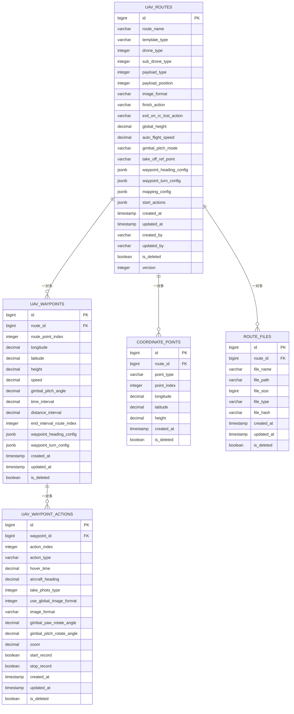
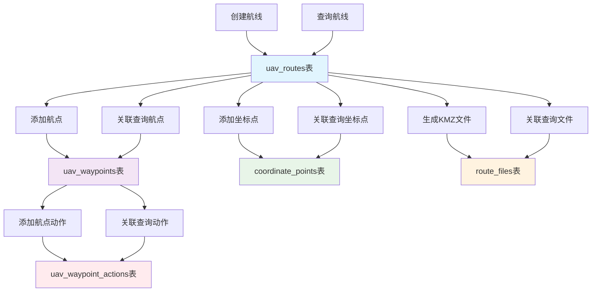

# 航线文件管理系统表设计图表

## 1. 数据库表关系图



## 2. 表结构详细设计

### 2.1 航线主表 (uav_routes)

| 字段名 | 数据类型 | 约束 | 说明 |
|--------|----------|------|------|
| id | BIGSERIAL | PRIMARY KEY | 主键，自增 |
| route_name | VARCHAR(255) | NOT NULL | 航线名称 |
| template_type | VARCHAR(50) | NOT NULL | 航线类型 |
| drone_type | INTEGER | NOT NULL | 无人机类型 |
| sub_drone_type | INTEGER | | 无人机子类型 |
| payload_type | INTEGER | | 负载类型 |
| payload_position | INTEGER | | 负载挂载位置 |
| image_format | VARCHAR(50) | | 负载图片存储类型 |
| finish_action | VARCHAR(50) | | 航线结束动作 |
| exit_on_rc_lost_action | VARCHAR(50) | | 失控动作 |
| global_height | DECIMAL(10,3) | | 全局航线高度(米) |
| auto_flight_speed | DECIMAL(8,3) | | 全局航线飞行速度(米/秒) |
| gimbal_pitch_mode | VARCHAR(50) | | 云台俯仰角控制模式 |
| take_off_ref_point | VARCHAR(100) | | 参考起飞点 |
| waypoint_heading_config | JSONB | | 全局偏航角模式配置 |
| waypoint_turn_config | JSONB | | 全局航点转弯模式配置 |
| mapping_config | JSONB | | 建图航拍配置参数 |
| start_actions | JSONB | | 航线初始动作列表 |
| created_at | TIMESTAMP WITH TIME ZONE | DEFAULT CURRENT_TIMESTAMP | 创建时间 |
| updated_at | TIMESTAMP WITH TIME ZONE | DEFAULT CURRENT_TIMESTAMP | 更新时间 |
| created_by | VARCHAR(100) | | 创建人 |
| updated_by | VARCHAR(100) | | 更新人 |
| is_deleted | BOOLEAN | DEFAULT FALSE | 软删除标记 |
| version | INTEGER | DEFAULT 1 | 乐观锁版本号 |

**索引设计：**
- `idx_uav_routes_template_type` (template_type)
- `idx_uav_routes_drone_type` (drone_type)
- `idx_uav_routes_created_at` (created_at DESC)
- `idx_uav_routes_is_deleted` (is_deleted)
- `idx_uav_routes_waypoint_heading_gin` GIN(waypoint_heading_config)
- `idx_uav_routes_waypoint_turn_gin` GIN(waypoint_turn_config)
- `idx_uav_routes_mapping_gin` GIN(mapping_config)

### 2.2 航点表 (uav_waypoints)

| 字段名 | 数据类型 | 约束 | 说明 |
|--------|----------|------|------|
| id | BIGSERIAL | PRIMARY KEY | 主键，自增 |
| route_id | BIGINT | NOT NULL, FK | 外键，关联航线表 |
| route_point_index | INTEGER | NOT NULL | 航点编号 |
| longitude | DECIMAL(12,9) | NOT NULL | 经度 |
| latitude | DECIMAL(12,9) | NOT NULL | 纬度 |
| height | DECIMAL(10,3) | | 高度(米) |
| speed | DECIMAL(8,3) | | 飞行速度(米/秒) |
| gimbal_pitch_angle | DECIMAL(8,3) | | 航点云台俯仰角 |
| time_interval | DECIMAL(8,3) | | 等时拍照间隔时间(秒) |
| distance_interval | DECIMAL(8,3) | | 等距拍照间隔距离(米) |
| end_interval_route_index | INTEGER | | 停止间隔拍照航点编号 |
| waypoint_heading_config | JSONB | | 航点偏航角配置 |
| waypoint_turn_config | JSONB | | 航点转弯模式配置 |
| created_at | TIMESTAMP WITH TIME ZONE | DEFAULT CURRENT_TIMESTAMP | 创建时间 |
| updated_at | TIMESTAMP WITH TIME ZONE | DEFAULT CURRENT_TIMESTAMP | 更新时间 |
| is_deleted | BOOLEAN | DEFAULT FALSE | 软删除标记 |

**外键约束：**
- `FOREIGN KEY (route_id) REFERENCES uav_routes(id) ON DELETE CASCADE`

**索引设计：**
- `idx_uav_waypoints_route_point` UNIQUE(route_id, route_point_index) WHERE is_deleted = FALSE
- `idx_uav_waypoints_route_id` (route_id)
- `idx_uav_waypoints_coordinates` (longitude, latitude)
- `idx_uav_waypoints_is_deleted` (is_deleted)
- `idx_uav_waypoints_heading_gin` GIN(waypoint_heading_config)
- `idx_uav_waypoints_turn_gin` GIN(waypoint_turn_config)

**检查约束：**
- `CHECK (longitude >= -180 AND longitude <= 180)`
- `CHECK (latitude >= -90 AND latitude <= 90)`
- `CHECK (route_point_index >= 0)`
- `CHECK (height IS NULL OR (height >= -1000 AND height <= 10000))`

### 2.3 航点动作表 (uav_waypoint_actions)

| 字段名 | 数据类型 | 约束 | 说明 |
|--------|----------|------|------|
| id | BIGSERIAL | PRIMARY KEY | 主键，自增 |
| waypoint_id | BIGINT | NOT NULL, FK | 外键，关联航点表 |
| action_index | INTEGER | NOT NULL | 动作编号(在航点内的顺序) |
| action_type | VARCHAR(50) | NOT NULL | 动作类型 |
| hover_time | DECIMAL(8,3) | | 悬停等待时间(秒) |
| aircraft_heading | DECIMAL(8,3) | | 飞行器目标偏航角(度) |
| take_photo_type | INTEGER | | 拍照类型(0:单拍 1:连拍) |
| use_global_image_format | INTEGER | | 是否使用全局拍照模式(0:否 1:是) |
| image_format | VARCHAR(50) | | 拍照模式(wide:广角 zoom:变焦 ir:红外) |
| gimbal_yaw_rotate_angle | DECIMAL(8,3) | | 云台偏航角(度) |
| gimbal_pitch_rotate_angle | DECIMAL(8,3) | | 云台俯仰角(度) |
| zoom | DECIMAL(8,3) | | 变焦焦距 |
| start_record | BOOLEAN | DEFAULT FALSE | 开始录像 |
| stop_record | BOOLEAN | DEFAULT FALSE | 停止录像 |
| created_at | TIMESTAMP WITH TIME ZONE | DEFAULT CURRENT_TIMESTAMP | 创建时间 |
| updated_at | TIMESTAMP WITH TIME ZONE | DEFAULT CURRENT_TIMESTAMP | 更新时间 |
| is_deleted | BOOLEAN | DEFAULT FALSE | 软删除标记 |

**外键约束：**
- `FOREIGN KEY (waypoint_id) REFERENCES uav_waypoints(id) ON DELETE CASCADE`

**索引设计：**
- `idx_uav_waypoint_actions_waypoint_action` UNIQUE(waypoint_id, action_index) WHERE is_deleted = FALSE
- `idx_uav_waypoint_actions_waypoint_id` (waypoint_id)
- `idx_uav_waypoint_actions_action_type` (action_type)
- `idx_uav_waypoint_actions_is_deleted` (is_deleted)

**检查约束：**
- `CHECK (action_index >= 0)`
- `CHECK (hover_time IS NULL OR hover_time >= 0)`
- `CHECK (aircraft_heading IS NULL OR (aircraft_heading >= -180 AND aircraft_heading <= 180))`
- `CHECK (gimbal_yaw_rotate_angle IS NULL OR (gimbal_yaw_rotate_angle >= -180 AND gimbal_yaw_rotate_angle <= 180))`
- `CHECK (gimbal_pitch_rotate_angle IS NULL OR (gimbal_pitch_rotate_angle >= -90 AND gimbal_pitch_rotate_angle <= 90))`
- `CHECK (zoom IS NULL OR zoom > 0)`

### 2.4 坐标点表 (coordinate_points)

| 字段名 | 数据类型 | 约束 | 说明 |
|--------|----------|------|------|
| id | BIGSERIAL | PRIMARY KEY | 主键，自增 |
| route_id | BIGINT | NOT NULL, FK | 外键，关联航线表 |
| point_type | VARCHAR(50) | NOT NULL | 坐标点类型(polygon, linestring等) |
| point_index | INTEGER | NOT NULL | 点序号 |
| longitude | DECIMAL(12,9) | NOT NULL | 经度 |
| latitude | DECIMAL(12,9) | NOT NULL | 纬度 |
| height | DECIMAL(10,3) | | 高度(米) |
| created_at | TIMESTAMP WITH TIME ZONE | DEFAULT CURRENT_TIMESTAMP | 创建时间 |
| is_deleted | BOOLEAN | DEFAULT FALSE | 软删除标记 |

**外键约束：**
- `FOREIGN KEY (route_id) REFERENCES uav_routes(id) ON DELETE CASCADE`

**索引设计：**
- `idx_coordinate_points_route_id` (route_id)
- `idx_coordinate_points_type` (point_type)
- `idx_coordinate_points_coordinates` (longitude, latitude)

### 2.5 航线文件表 (route_files)

| 字段名 | 数据类型 | 约束 | 说明 |
|--------|----------|------|------|
| id | BIGSERIAL | PRIMARY KEY | 主键，自增 |
| route_id | BIGINT | NOT NULL, FK | 外键，关联航线表 |
| file_name | VARCHAR(255) | NOT NULL | 文件名 |
| file_path | VARCHAR(500) | NOT NULL | 文件路径 |
| file_size | BIGINT | | 文件大小(字节) |
| file_type | VARCHAR(50) | DEFAULT 'KMZ' | 文件类型 |
| file_hash | VARCHAR(64) | | 文件MD5哈希值 |
| created_at | TIMESTAMP WITH TIME ZONE | DEFAULT CURRENT_TIMESTAMP | 创建时间 |
| updated_at | TIMESTAMP WITH TIME ZONE | DEFAULT CURRENT_TIMESTAMP | 更新时间 |
| is_deleted | BOOLEAN | DEFAULT FALSE | 软删除标记 |

**外键约束：**
- `FOREIGN KEY (route_id) REFERENCES uav_routes(id) ON DELETE CASCADE`

**索引设计：**
- `idx_route_files_route_id` (route_id)
- `idx_route_files_file_type` (file_type)
- `idx_route_files_created_at` (created_at DESC)

## 3. 数据流向图



## 4. 枚举类型定义

### 4.1 航线模板类型
```sql
CREATE TYPE template_type_enum AS ENUM (
    'waypoint',      -- 航点飞行
    'mapping2d',     -- 建图航拍
    'mapping3d',     -- 倾斜摄影
    'strip'          -- 航带飞行
);
```

### 4.2 无人机类型
```sql
CREATE TYPE drone_type_enum AS ENUM (
    'M300_RTK',      -- 91
    'M350_RTK',      -- 92
    'M30',           -- 67
    'M30T',          -- 68
    'M3E',           -- 77
    'M3T',           -- 78
    'M3M',           -- 79
    'M3D',           -- 80
    'M3TD',          -- 81
    'M4E',           -- 82
    'M4T'            -- 83
);
```

### 4.3 动作类型
```sql
CREATE TYPE action_type_enum AS ENUM (
    'hover',         -- 悬停
    'take_photo',    -- 拍照
    'start_record',  -- 开始录像
    'stop_record',   -- 停止录像
    'gimbal_rotate', -- 云台旋转
    'aircraft_yaw'   -- 飞行器偏航
);
```

## 5. JSONB字段结构示例

### 5.1 waypoint_heading_config
```json
{
    "waypointHeadingMode": "smoothTransition",
    "waypointHeadingAngle": 90.0,
    "waypointPoiPoint": "22.581115,113.940282,0"
}
```

### 5.2 waypoint_turn_config
```json
{
    "waypointTurnMode": "toPointAndStopWithDiscontinuityCurvature",
    "waypointTurnDampingDist": 0.2,
    "useStraightLine": 0
}
```

### 5.3 mapping_config
```json
{
    "collectionMethod": "hover",
    "lensType": "wide",
    "overlapH": 80,
    "overlapW": 70,
    "elevationOptimizeEnable": 1,
    "shootType": "single",
    "direction": "90",
    "margin": "30"
}
```

### 5.4 start_actions (航线初始动作列表)
```json
[
    {
        "actionIndex": 0,
        "hoverTime": 2.0,
        "aircraftHeading": 90.0,
        "takePhotoType": 0,
        "useGlobalImageFormat": 1,
        "imageFormat": "wide",
        "gimbalYawRotateAngle": 0.0,
        "gimbalPitchRotateAngle": -90.0,
        "zoom": 1.0,
        "startRecord": false,
        "stopRecord": false
    }
]
```

## 6. 表关系说明

### 6.1 主要关系
- **uav_routes** 与 **uav_waypoints**：一对多关系，一条航线包含多个航点
- **uav_waypoints** 与 **uav_waypoint_actions**：一对多关系，一个航点包含多个动作
- **uav_routes** 与 **coordinate_points**：一对多关系，一条航线包含多个坐标点（用于测区多边形等）
- **uav_routes** 与 **route_files**：一对多关系，一条航线可以生成多个文件

### 6.2 级联删除
- 删除航线时，自动删除相关的航点、坐标点和文件记录
- 删除航点时，自动删除相关的航点动作记录
- 使用 `ON DELETE CASCADE` 约束确保数据一致性

### 6.3 软删除策略
- 所有表都使用 `is_deleted` 字段实现软删除
- 查询时需要添加 `WHERE is_deleted = FALSE` 条件

## 7. 性能优化要点

### 7.1 索引策略
- **B-Tree索引**：用于常规查询字段
- **GIN索引**：用于JSONB字段的复杂查询
- **复合索引**：用于多字段组合查询
- **唯一索引**：确保数据唯一性

### 7.2 查询优化
- 利用JSONB操作符进行高效的JSON查询
- 合理使用分区表处理大数据量
- 定期维护表统计信息

### 7.3 存储优化
- JSONB字段使用TOAST存储大型数据
- 定期执行VACUUM和ANALYZE
- 监控表膨胀情况

## 8. 优化后的性能分析

### 8.1 优化前后对比

| 方面 | 优化前(JSONB存储) | 优化后(独立表存储) |
|------|------------------|-------------------|
| 查询性能 | 需要解析JSONB，性能较低 | 直接SQL查询，性能高 |
| 索引效率 | GIN索引，复杂查询慢 | B-Tree索引，查询快 |
| 数据完整性 | 依赖应用层校验 | 数据库约束保证 |
| 存储空间 | JSONB压缩存储 | 结构化存储，略大 |
| 扩展性 | 修改JSONB结构复杂 | 添加字段简单 |
| 并发性能 | 整行锁定 | 细粒度锁定 |

### 8.2 查询性能提升

**优化前查询航点动作：**
```sql
-- 查询包含拍照动作的航点（慢）
SELECT w.* FROM uav_waypoints w 
WHERE w.actions @> '[{"takePhotoType": 0}]';
```

**优化后查询航点动作：**
```sql
-- 查询包含拍照动作的航点（快）
SELECT DISTINCT w.* 
FROM uav_waypoints w
JOIN uav_waypoint_actions a ON w.id = a.waypoint_id
WHERE a.take_photo_type = 0 AND a.is_deleted = FALSE;
```

## 9. 常用查询示例

### 9.1 基础查询

```sql
-- 查询航线及其所有航点和动作
SELECT 
    r.route_name,
    w.route_point_index,
    w.longitude,
    w.latitude,
    a.action_type,
    a.action_index
FROM uav_routes r
JOIN uav_waypoints w ON r.id = w.route_id
LEFT JOIN uav_waypoint_actions a ON w.id = a.waypoint_id
WHERE r.id = ? AND r.is_deleted = FALSE
ORDER BY w.route_point_index, a.action_index;
```

### 9.2 统计查询

```sql
-- 统计每条航线的航点数量和动作数量
SELECT 
    r.route_name,
    COUNT(DISTINCT w.id) as waypoint_count,
    COUNT(a.id) as action_count
FROM uav_routes r
LEFT JOIN uav_waypoints w ON r.id = w.route_id AND w.is_deleted = FALSE
LEFT JOIN uav_waypoint_actions a ON w.id = a.waypoint_id AND a.is_deleted = FALSE
WHERE r.is_deleted = FALSE
GROUP BY r.id, r.route_name;
```

### 9.3 复杂查询

```sql
-- 查询包含特定动作类型的航线
SELECT DISTINCT r.*
FROM uav_routes r
JOIN uav_waypoints w ON r.id = w.route_id
JOIN uav_waypoint_actions a ON w.id = a.waypoint_id
WHERE a.action_type = 'take_photo' 
  AND a.take_photo_type = 0
  AND r.is_deleted = FALSE
  AND w.is_deleted = FALSE
  AND a.is_deleted = FALSE;
```

## 10. 数据迁移策略

### 10.1 从JSONB迁移到独立表

```sql
-- 1. 创建新的航点动作表
CREATE TABLE uav_waypoint_actions (
    -- 表结构如上所述
);

-- 2. 迁移数据
INSERT INTO uav_waypoint_actions (
    waypoint_id, action_index, action_type, hover_time, 
    aircraft_heading, take_photo_type, use_global_image_format,
    image_format, gimbal_yaw_rotate_angle, gimbal_pitch_rotate_angle,
    zoom, start_record, stop_record, created_at
)
SELECT 
    w.id as waypoint_id,
    (action->>'actionIndex')::INTEGER as action_index,
    CASE 
        WHEN (action->>'takePhotoType')::INTEGER IS NOT NULL THEN 'take_photo'
        WHEN (action->>'startRecord')::BOOLEAN = true THEN 'start_record'
        WHEN (action->>'stopRecord')::BOOLEAN = true THEN 'stop_record'
        ELSE 'hover'
    END as action_type,
    (action->>'hoverTime')::DECIMAL as hover_time,
    (action->>'aircraftHeading')::DECIMAL as aircraft_heading,
    (action->>'takePhotoType')::INTEGER as take_photo_type,
    (action->>'useGlobalImageFormat')::INTEGER as use_global_image_format,
    action->>'imageFormat' as image_format,
    (action->>'gimbalYawRotateAngle')::DECIMAL as gimbal_yaw_rotate_angle,
    (action->>'gimbalPitchRotateAngle')::DECIMAL as gimbal_pitch_rotate_angle,
    (action->>'zoom')::DECIMAL as zoom,
    (action->>'startRecord')::BOOLEAN as start_record,
    (action->>'stopRecord')::BOOLEAN as stop_record,
    w.created_at
FROM uav_waypoints w,
     jsonb_array_elements(w.actions) as action
WHERE w.actions IS NOT NULL AND w.is_deleted = FALSE;

-- 3. 验证数据迁移
SELECT 
    COUNT(*) as total_actions,
    COUNT(DISTINCT waypoint_id) as waypoints_with_actions
FROM uav_waypoint_actions;

-- 4. 删除原JSONB字段（谨慎操作）
-- ALTER TABLE uav_waypoints DROP COLUMN actions;
```

### 10.2 回滚策略

```sql
-- 如需回滚，重新生成JSONB字段
UPDATE uav_waypoints 
SET actions = (
    SELECT jsonb_agg(
        jsonb_build_object(
            'actionIndex', a.action_index,
            'hoverTime', a.hover_time,
            'aircraftHeading', a.aircraft_heading,
            'takePhotoType', a.take_photo_type,
            'useGlobalImageFormat', a.use_global_image_format,
            'imageFormat', a.image_format,
            'gimbalYawRotateAngle', a.gimbal_yaw_rotate_angle,
            'gimbalPitchRotateAngle', a.gimbal_pitch_rotate_angle,
            'zoom', a.zoom,
            'startRecord', a.start_record,
            'stopRecord', a.stop_record
        ) ORDER BY a.action_index
    )
    FROM uav_waypoint_actions a
    WHERE a.waypoint_id = uav_waypoints.id AND a.is_deleted = FALSE
)
WHERE EXISTS (
    SELECT 1 FROM uav_waypoint_actions a 
    WHERE a.waypoint_id = uav_waypoints.id AND a.is_deleted = FALSE
);
```

---

本优化后的表设计图表提供了航线文件管理系统的完整数据库结构，通过将航点动作从JSONB字段分离到独立表，显著提升了查询性能和数据管理效率，同时保持了良好的扩展性和数据完整性。