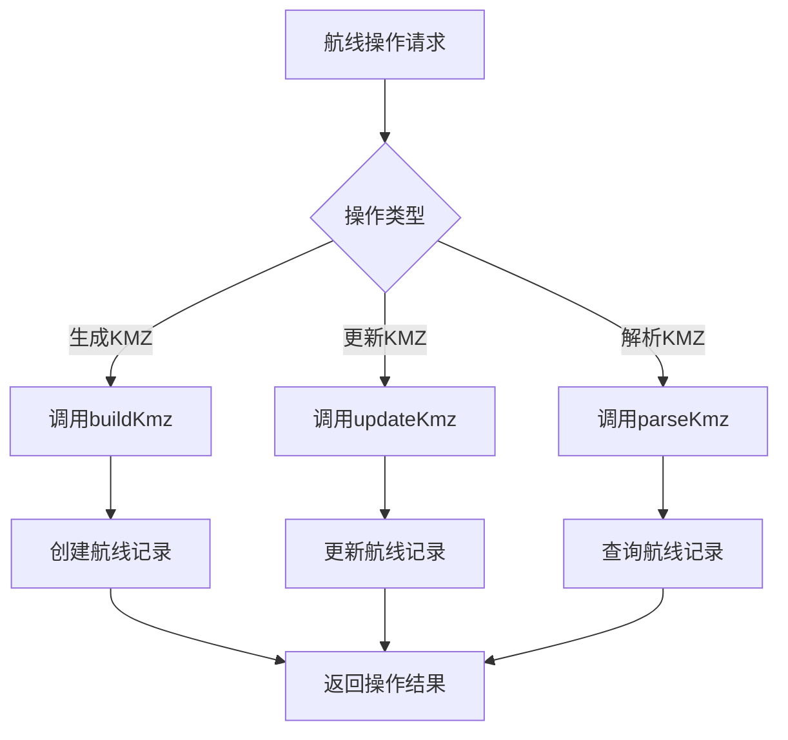

# 航线文件管理系统需求文档

## 1. Product Overview
基于现有Spring Boot项目的航线文件生成记录管理系统，围绕KmlInfo类设计数据库表结构，实现航线文件生成记录的增删改查功能。
- 解决航线文件生成记录缺乏持久化存储和管理的问题，为运维人员和开发人员提供完整的航线文件操作历史追踪。
- 通过零侵入性设计确保与现有业务逻辑完全解耦，提升系统的可维护性和扩展性。

## 2. Core Features

### 2.1 User Roles
本系统不涉及用户角色管理，专注于航线文件记录的数据管理功能。

### 2.2 Feature Module
航线文件管理系统包含以下核心功能模块：
1. **航线记录创建**：记录航线文件生成操作的详细信息
2. **航线记录查询**：支持多条件查询航线文件生成历史
3. **航线记录更新**：更新航线文件记录的状态和相关信息
4. **航线记录删除**：删除指定的航线文件记录

### 2.3 Page Details

| Page Name | Module Name | Feature description |
|-----------|-------------|---------------------|
| 航线记录管理 | 记录创建模块 | 创建新的航线文件生成记录，包含KML信息、文件路径、操作类型等 |
| 航线记录管理 | 记录查询模块 | 根据ID、创建时间、操作状态等条件查询航线记录，支持分页和排序 |
| 航线记录管理 | 记录更新模块 | 更新航线记录的状态、更新时间、备注信息等字段 |
| 航线记录管理 | 记录删除模块 | 根据ID删除指定的航线文件记录，支持批量删除 |

## 3. Core Process

### 主要操作流程
1. **记录创建流程**：当调用buildKmz或updateKmz方法时，自动创建对应的航线记录
2. **记录查询流程**：通过API接口查询航线记录，支持条件筛选和分页
3. **记录更新流程**：根据业务需要更新记录状态或相关信息
4. **记录删除流程**：清理过期或无效的航线记录

## 4. User Interface Design

### 4.1 Design Style
本系统主要提供API接口，不涉及前端UI设计。API响应格式采用标准的RESTful风格：
- 响应格式：JSON
- 状态码：标准HTTP状态码
- 错误处理：统一的错误响应格式
- 数据格式：驼峰命名法

### 4.2 Page Design Overview

| Page Name | Module Name | UI Elements |
|-----------|-------------|-------------|
| API接口 | 数据响应格式 | JSON格式响应，包含状态码、消息、数据等标准字段 |

### 4.3 Responsiveness
本系统为后端API服务，不涉及响应式设计。API接口支持跨平台调用，兼容各种客户端环境。